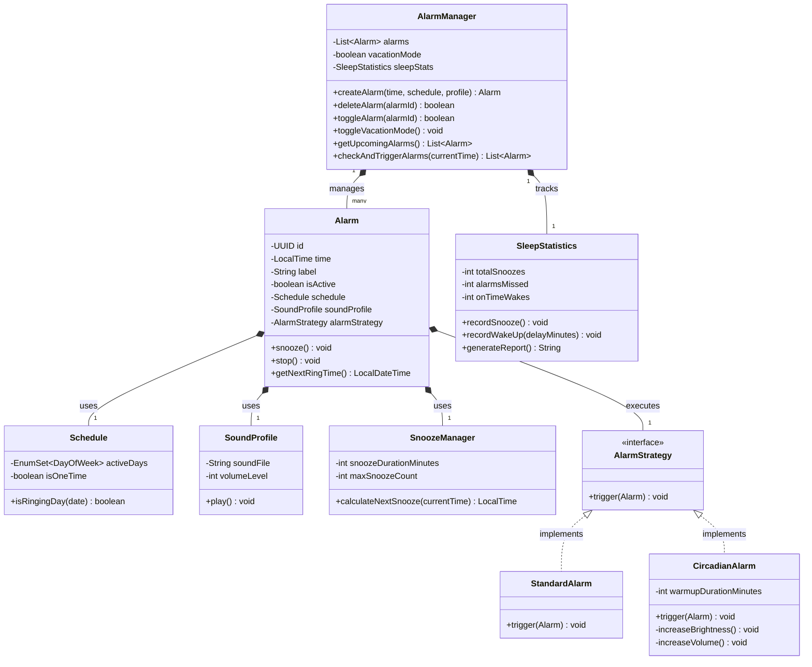
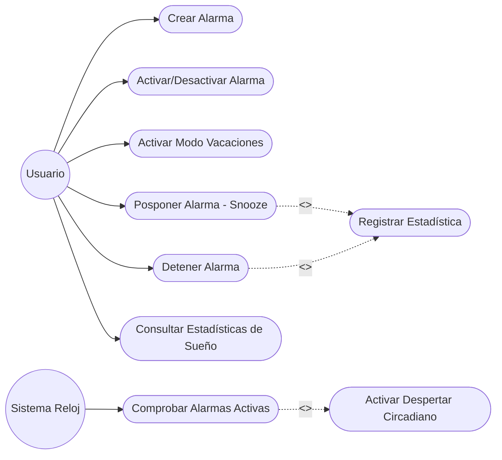

Pablo Espinosa Pérez

# Sistema de Despertador Inteligente

Este proyecto implementa la lógica interna en Java para una aplicación de despertador inteligente avanzada, desarrollada siguiendo principios de diseño orientado a objetos (POO) y arquitectura limpia.

## 1. Diagrama de Clases UML
Este diagrama representa la estructura de las clases del sistema, sus responsabilidades y cómo se relacionan entre sí utilizando patrones de diseño como *Strategy*.

## 2. Diagrama de Casos de Uso UML
Este diagrama modela cómo interactúa el usuario y el sistema con las diferentes funcionalidades de la aplicación.

